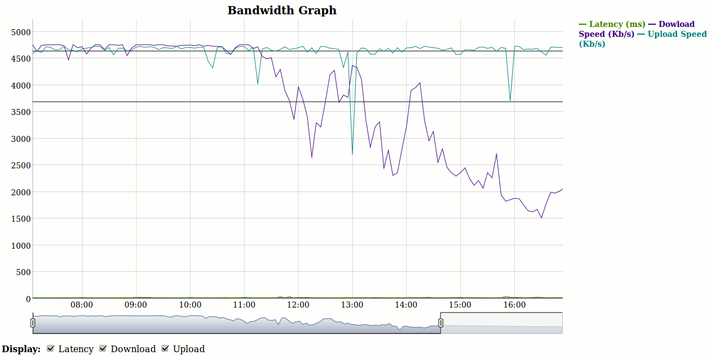

# html-bandwidth-report
HTML/JS to make graphic bandwith reports made with a modified version of Speedtest-cli. You can show upload, dowload speed and latency combined or separatedly. Also displays averages.

 

# Usage
This application can be run as a server by running the following command:

```
python run.py
```

# Licensing
The `speedtest_cli.py` and  `speedtest-cli.1` files are licensed under the [Apache License 2.0](http://www.apache.org/licenses/LICENSE-2.0), see each of the files and [gonzalo's fork](https://github.com/gonzalo/speedtest-cli) of the GitHub repo of [speedtest-cli](https://github.com/sivel/speedtest-cli) for more information.

The `bandwidth.html` and `bandwidth_report_sample.csv` files are licensed under the [GPLv2](https://www.gnu.org/licenses/old-licenses/gpl-2.0.en.html) license.

The `run.py` file is licensed under [The MIT License](http://opensource.org/licenses/MIT), see the file for more information.

All of the image files in the project are licensed under the [CC BY 4.0](https://creativecommons.org/licenses/by/4.0/) license.

Any other files not mentioned are licensed under the [The MIT License](http://opensource.org/licenses/MIT), unless otherwise noted within the specific file.
